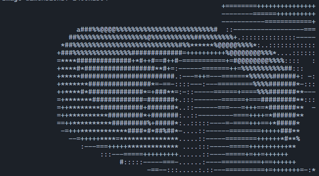

# Rust program to create ASCII art from image 👍

## Usage

put a image named `image.png` in same directory as the program and run
```bash
cargo run --release
```

## Example


<br>
⬇️⬇️⬇️<br>

